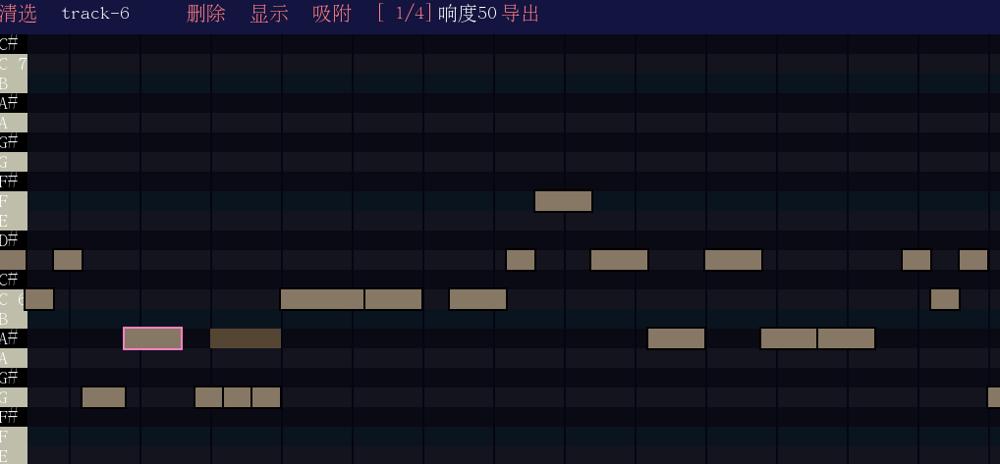

# MGenner  
midi在线编辑器，使用emscripten开发，留有js API，便于与自己的前端应用嵌合。  

本项目为歌声合成器设计，没有采用音轨的机制，而是采用了允许对每个音符命名的方式。生成Midi文件的时候会自动按照命名生成音轨。  
[在线使用](http://game.sinriv.com/mgenner)  
## js API  
基本api:  
`loadStringData(string)` 加载序列化的字符串数据  
`loadMidiFile(url)` 从url加载文件(支持mid格式或者自己的序列化格式)  
`toStringData(function(data){})` 将数据转成序列化格式（异步）  
`exportMidiFile()`　导出mid格式（返回一个blob）  
配合以下三个函数可实现对比两个midi文件的差异  
`toHashSerious(function(data){})` 将midi数据转换成序列哈希（用来进行diff操作）  
`midiDiff(hash,function(tick){})` 将序列哈希与自己对比，将与自己不同的tick通过回调函数返回  
`seekTick(tick)` 跳转到指定tick  
